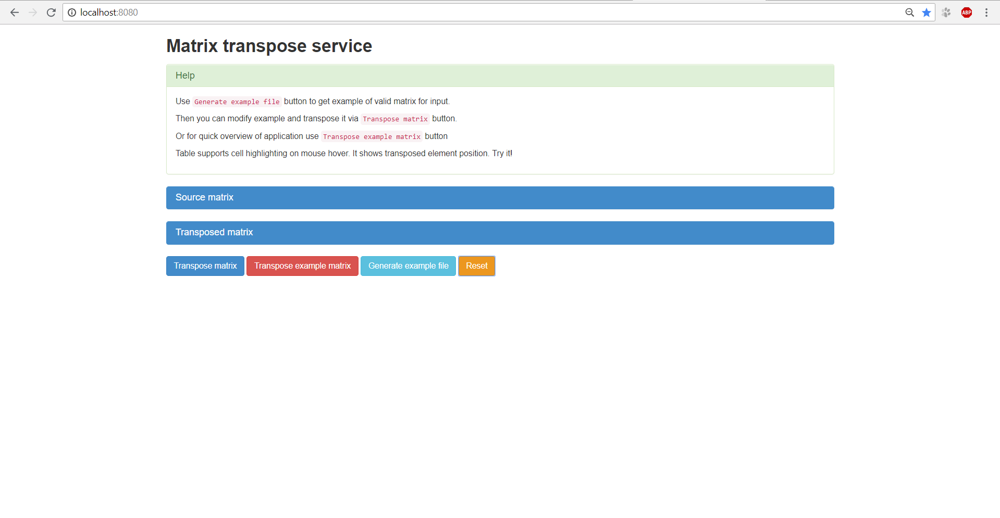
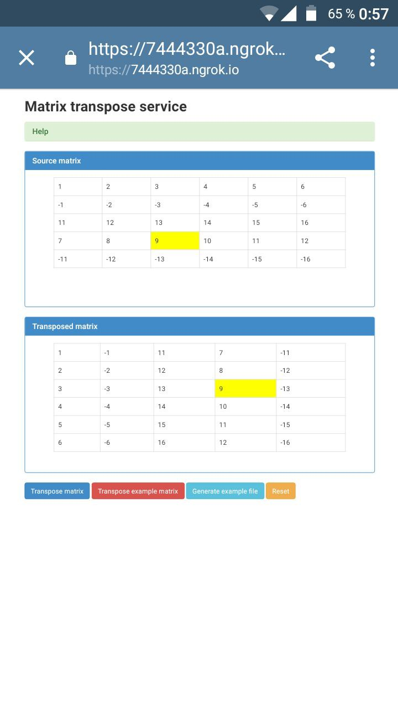

# Matrix transpose service

Simple matrix transpose service. Implemented both back-end and front-end parts.

Technologies:
* Scala
* Akka http
* Bootstrap
* jQuery

How to run:

1. It's assumed that you are in project root now
2. Run Scala app
```shell
sbt run
```
3. Open in browser [http://localhost:8080](http://localhost:8080)
4. Read the help info

Screenshots:




<p align="center">
    
</p>
